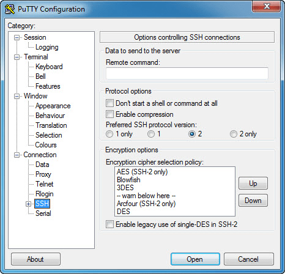

# Connecting to Teton HPC Environment

This server uses two-factor authentication.  If you are unsure of what that means, [see this](https://authy.com/what-is-2fa/), or for more details, [see this wikipedia page](https://en.wikipedia.org/wiki/Multi-factor_authentication).  Essentially that means you will need two pieces of identification to prove who you are to the system.  Before you begin, you will need the following items:

- A netid/password combination
- [A yubikey](http://www.yubico.com), or the [Duo Mobile App for Android](https://play.google.com/store/apps/details?id=com.duosecurity.duomobile&hl=en_US) or [for iOS](https://itunes.apple.com/us/app/duo-mobile/id422663827).
	- Yubikey must be obtained from [ARCC](http://www.uwyo.edu/arcc).
	- If you are going to use Duo, [register your mobile device here](https://uwyo.teamdynamix.com/TDClient/KB/ArticleDet?ID=11313) (Scroll down to ``Enroll a Device``).

### Windows OS

Connecting to Teton requires the use of a Terminal, also called a console or shell.  On Windows, you will need to download and install the Putty SSH client.  

- [Download Putty Here](https://www.chiark.greenend.org.uk/~sgtatham/putty/latest.html): Choose 64bit unless you are using a very old computer with 32bit processor.

 
### Mac OS or Linux

These platforms have a terminal/console built into the operating system.  On Mac, search for Terminal.app in spotlight search.  On Linux, the console is most likely a desktop icon.


## **S**ecure **SH**ell Protocol (SSH)
In simplest terms, Secure SHell protocol (or SSH) is a communication protocol that uses encryption technology to keep your dialogue with the remote computers secure. It can be used as follows:

```bash
ssh username@serverID
```
Where:

    - ``ssh`` is the name of the program you are invoking

    - ``username`` is your username on the server

    - ``serverID`` is either IP address (e.g. ``111.222.333.444``) or a proper domain name e.g. ``teton.uwyo.edu``

When you connect to Teton, you will replace these terms with your own information.

## Test Connection
### Using Putty
When you launch Putty client, it will open up a dialogue box as follows:

<center>

</center>

- In the left navigation menu, select SSH, then under remote command, enter the connection command: ``ssh username@teton.uwyo.edu``.

- This will open up a dark terminal window where you will be prompted for the two factor password.  Enter it as follows: ``MY_PASSWORD,6_DIGIT_DUO_CODE``.  So if your password was ``6%99XPE$$abc`` and the duo code was ``120201``, you will enter ``6%99XPE$$abc,120201`` and hit enter.  **You will not see cursor move as you type, this is by design.**  Also, make sure to type the comma between the two passwords.

- You should be logged in at this point.

### Using MacOS or Linux
The directions are similar, except that you won't have a GUI client.  Open the terminal and follow the directions from the section above.


